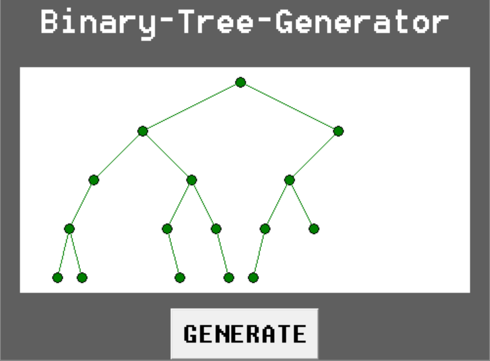

# Random-Binary-Tree-Generator

 A program that uses a GUI and creates a simple randomly generated binary tree

## Table of Contents
- [About](#about)
- [Getting Started](#getting_started)
- [How to Use](#usage)
- [Authors](#authors)
## About 
This program was created in order to build up programming skill and also show my comprehension of binary trees. This program was created over the span of one day.
## Getting Started 
What you will need to run this program: 
- <em>Python</em>- To run this program, you must have some way to run a .py file. Also, this program was written using python 3.8.3, and has not been tested using any other version.
## How to Use 
After installing and adding everything necessary, all you need to do is run the program, and click the GENERATE button to create a new binary tree.
## Author 
[@AlexHettle](https://github.com/AlexHettle) - Sole author of project
